# Mini Cloud Zero Trust

Mini-cloud Kubernetes sécurisé avec une approche **Zero Trust**. Le projet déploie une application en trois couches dans un cluster k3s, puis ajoute les contrôles de sécurité nécessaires : durcissement Linux, segmentation réseau Kubernetes, IAM Keycloak, OAuth2-Proxy, AppArmor, rsyslog et Suricata.

## Objectifs

- Construire un cluster k3s avec un noeud master et un noeud worker.
- Déployer un frontend, un backend et une base PostgreSQL dans un namespace dédié.
- Exposer uniquement le frontend via Ingress.
- Protéger l'accès applicatif avec Keycloak, MFA et OAuth2-Proxy.
- Appliquer une microsegmentation stricte avec des NetworkPolicies.
- Renforcer les machines Ubuntu qui hébergent le cluster.
- Centraliser les logs et détecter les comportements réseau suspects.

## Architecture

```text
Utilisateur
    |
    v
frontend.local
    |
    v
Ingress Traefik
    |
    v
OAuth2-Proxy (PEP)
    |
    +--> Keycloak (IdP / MFA / rôles)
    |
    v
Frontend Nginx
    |
    v
Backend httpbin
    |
    v
PostgreSQL
```

Les flux internes sont contrôlés par les NetworkPolicies :

- `frontend` peut joindre `backend` sur le port `80`.
- `backend` peut joindre `db` sur le port `5432`.
- Les autres communications sont refusées par défaut.

## Environnement

| Rôle | Nom | IP | OS |
| --- | --- | --- | --- |
| Master k3s | `vm-master` | `192.168.56.10` | Ubuntu Server 22.04 |
| Worker k3s | `vm-worker` | `192.168.56.11` | Ubuntu Server 22.04 |

Entrées locales à ajouter dans `/etc/hosts` sur la machine hôte :

```text
192.168.56.10 frontend.local
192.168.56.10 keycloak.local
```

Le script [scripts/setup_hosts.sh](/home/sedra/Documents/cours_cyber/Crypto/mini_cloud_git/mini-cloud-zero-trust/scripts/setup_hosts.sh) ajoute ces deux entrées automatiquement.

## Structure

```text
mini-cloud-zero-trust/
├── docs/
│   └── screenshots/        # Captures du déploiement et des validations
├── hardening/              # Configurations Linux, AppArmor, rsyslog, Suricata
├── manifests/              # Manifests Kubernetes
├── scripts/                # Scripts d'installation et de déploiement
└── README.md
```

## Installation Rapide

### 1. Installer k3s sur le master

Sur `vm-master` :

```bash
chmod +x scripts/install_k3s_master.sh
sudo ./scripts/install_k3s_master.sh
```

Récupérer ensuite le token du cluster :

```bash
sudo cat /var/lib/rancher/k3s/server/node-token
```

### 2. Joindre le worker

Sur `vm-worker`, remplacer `<NODE_TOKEN>` dans [scripts/join_k3s_worker.sh](/home/sedra/Documents/cours_cyber/Crypto/mini_cloud_git/mini-cloud-zero-trust/scripts/join_k3s_worker.sh), puis lancer :

```bash
chmod +x scripts/join_k3s_worker.sh
sudo ./scripts/join_k3s_worker.sh
```

Vérifier le cluster depuis `vm-master` :

```bash
kubectl get nodes -o wide
```

### 3. Déployer les manifests Kubernetes

Depuis le dossier du projet :

```bash
kubectl apply -f manifests/
```

Ou avec le script :

```bash
chmod +x scripts/deploy_all.sh
./scripts/deploy_all.sh
```

### 4. Vérifier les ressources

```bash
kubectl get pods -n zerotrust
kubectl get svc -n zerotrust
kubectl get ingress -n zerotrust
kubectl get networkpolicy -n zerotrust
```

Tester le frontend :

```bash
curl http://frontend.local
```

## Composants Kubernetes

| Fichier | Rôle |
| --- | --- |
| `manifests/ns-zerotrust.yaml` | Namespace applicatif isolé |
| `manifests/frontend.yaml` | Frontend Nginx `nginxdemos/hello` |
| `manifests/backend.yaml` | Backend API `kennethreitz/httpbin` |
| `manifests/db.yaml` | PostgreSQL avec Secret, PVC, Deployment et Service |
| `manifests/ingress-frontend.yaml` | Exposition initiale du frontend |
| `manifests/keycloak*.yaml` | Déploiement et configuration Keycloak |
| `manifests/oauth2-proxy.yaml` | Proxy d'authentification OIDC |
| `manifests/ingress-frontend-oauth2.yaml` | Ingress routé vers OAuth2-Proxy |
| `manifests/np-*.yaml` | Microsegmentation réseau |

Le fichier `manifests/oauth2-secret.yaml.example` sert de modèle. Le vrai secret OIDC ne doit pas être versionné.

## Sécurité Zero Trust

### Identité et accès

- **Keycloak** centralise les identités, les realms, les utilisateurs, les rôles et le MFA.
- **OAuth2-Proxy** agit comme Policy Enforcement Point : il bloque l'accès au frontend tant que l'utilisateur n'est pas authentifié.
- Le frontend est protégé par un flux OIDC avec redirection vers Keycloak.

### Microsegmentation

- `np-deny-all.yaml` bloque tous les flux par défaut.
- `np-frontend-backend.yaml` autorise uniquement le flux frontend vers backend.
- `np-backend-db.yaml` autorise uniquement le flux backend vers PostgreSQL.
- `np-allow-dns.yaml` permet la résolution DNS nécessaire aux pods.

### Durcissement système

Les fichiers dans `hardening/` renforcent les VMs Ubuntu :

- `99-hardening.conf` : paramètres `sysctl` pour le noyau Linux.
- `sshd_config_snippet.conf` : restrictions SSH, clé publique, MFA et accès root désactivé.
- `rsyslog/10-remote.conf` : centralisation des journaux.
- `apparmor/default-profile.txt` : confinement applicatif.
- `suricata/suricata.yaml` : configuration IDS réseau.

## Captures

### Architecture Zero Trust

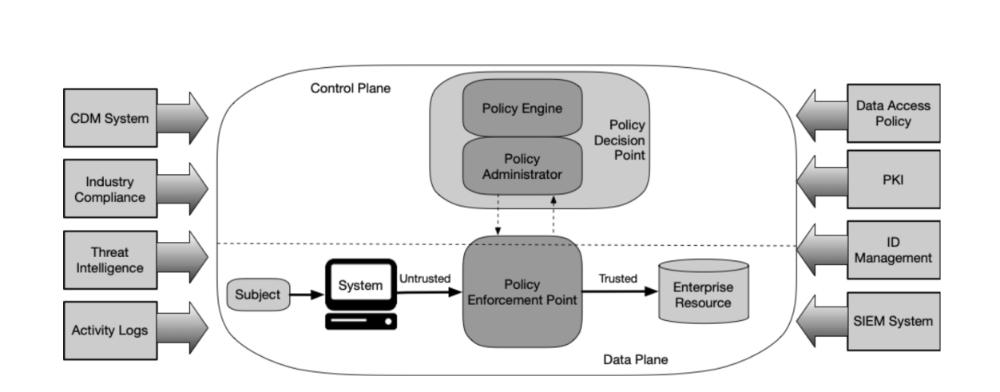

### Cluster k3s opérationnel

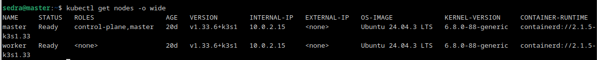

### Frontend exposé via Ingress

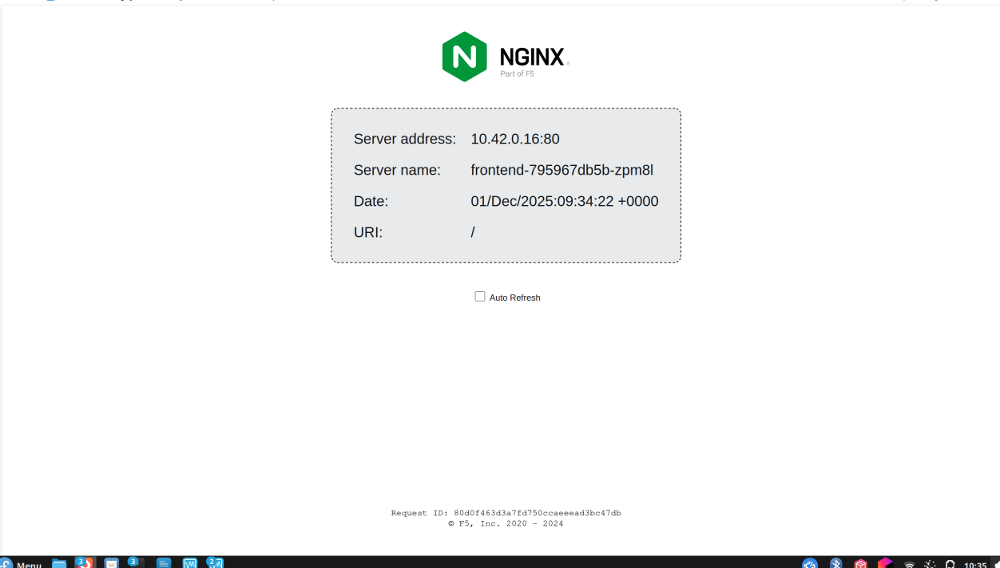

### Durcissement noyau avec sysctl

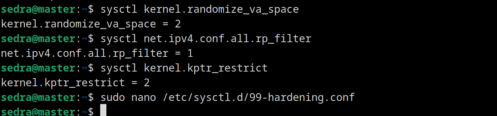

### Logs centralisés avec rsyslog

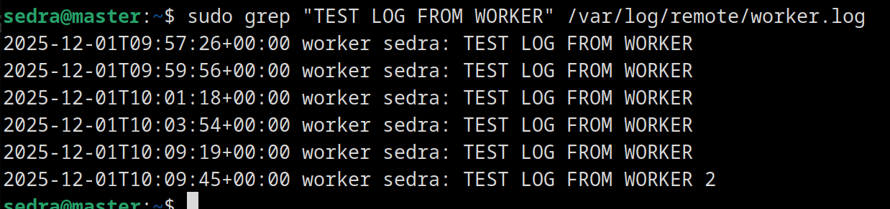

### AppArmor en mode enforcing

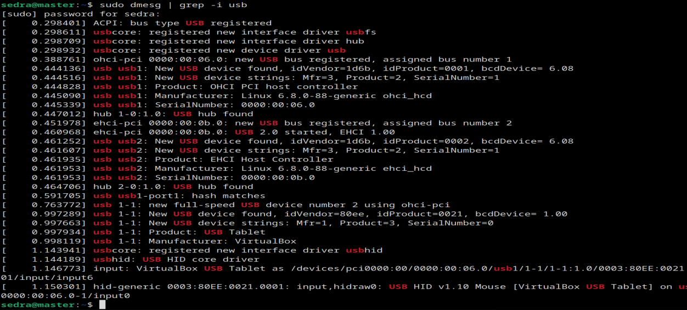

### Suricata détecte du trafic suspect

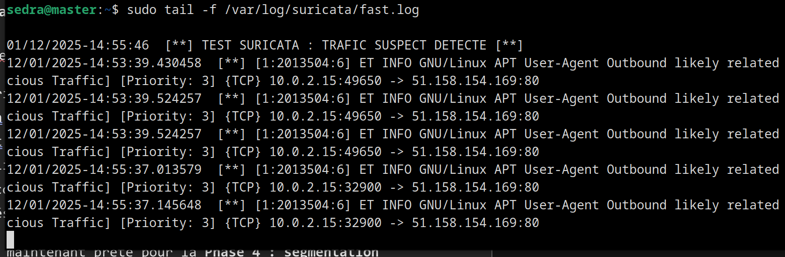

### Authentification Keycloak

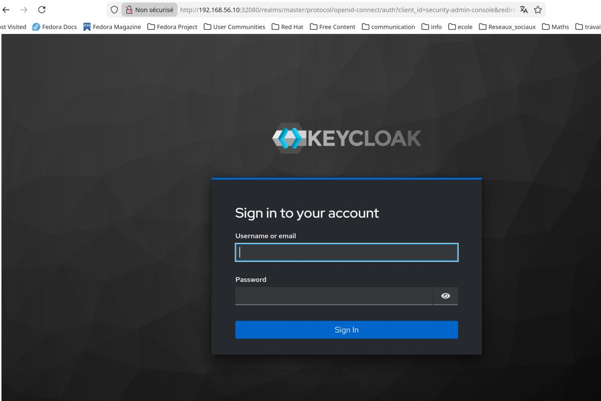

### MFA dans Keycloak

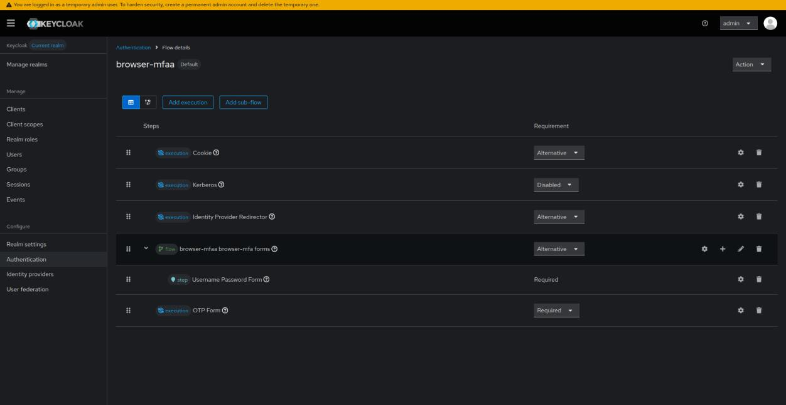

### OAuth2-Proxy et Ingress protégé

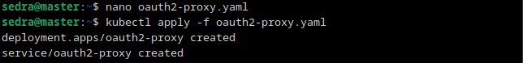

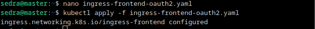

### NetworkPolicies

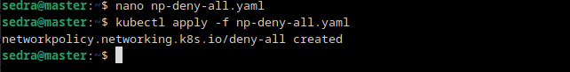

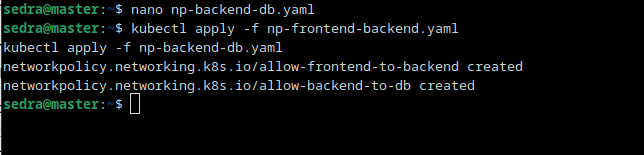

## Commandes de Validation

Vérifier que les pods applicatifs tournent :

```bash
kubectl get pods -n zerotrust -o wide
```

Vérifier les services :

```bash
kubectl get svc -n zerotrust
```

Tester le backend depuis le cluster :

```bash
kubectl exec -n zerotrust deploy/backend -- curl -s http://localhost/get
```

Tester l'accès frontend :

```bash
curl -v http://frontend.local
```

Lister les politiques réseau :

```bash
kubectl get networkpolicy -n zerotrust
kubectl describe networkpolicy -n zerotrust
```

Vérifier les logs Suricata :

```bash
sudo tail -f /var/log/suricata/fast.log
```

Vérifier les logs centralisés :

```bash
sudo tail -f /var/log/remote/vm-worker.log
```

## Résultat

Le projet fournit un mini-cloud k3s fonctionnel, segmenté et protégé selon les principes Zero Trust : aucune confiance implicite, accès applicatif vérifié, flux réseau explicitement autorisés, machines durcies et supervision sécurité activée.
